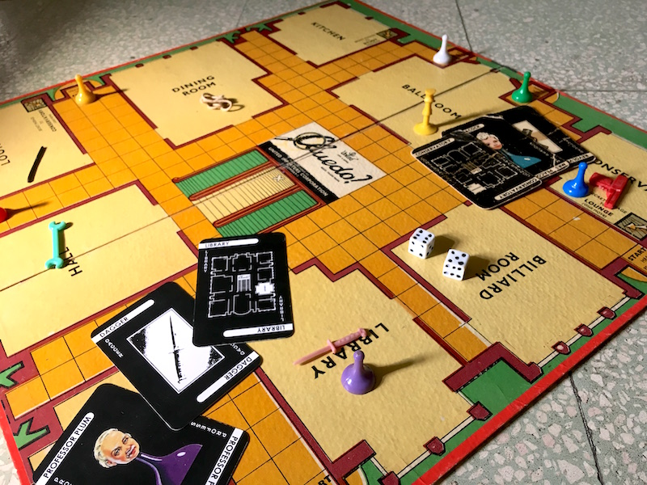
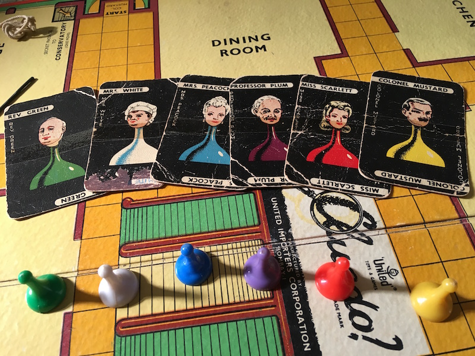
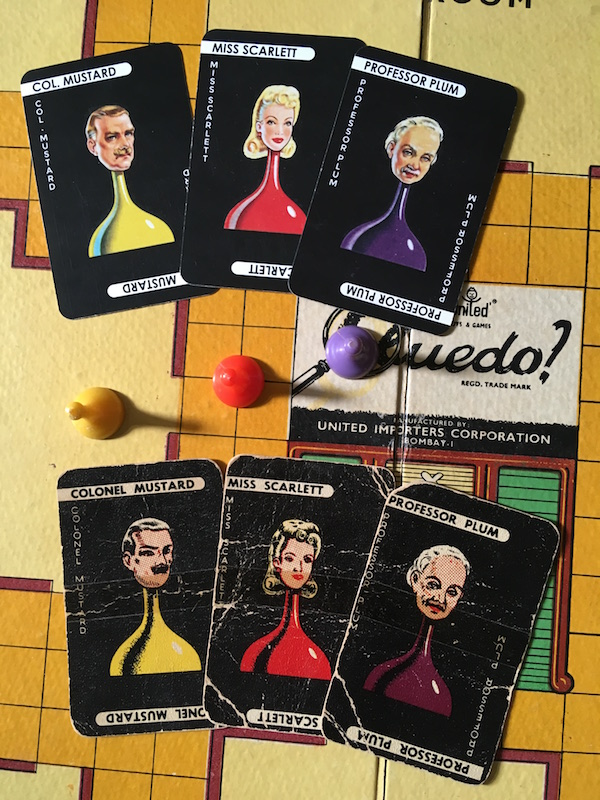
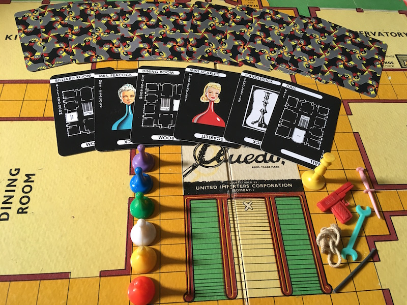
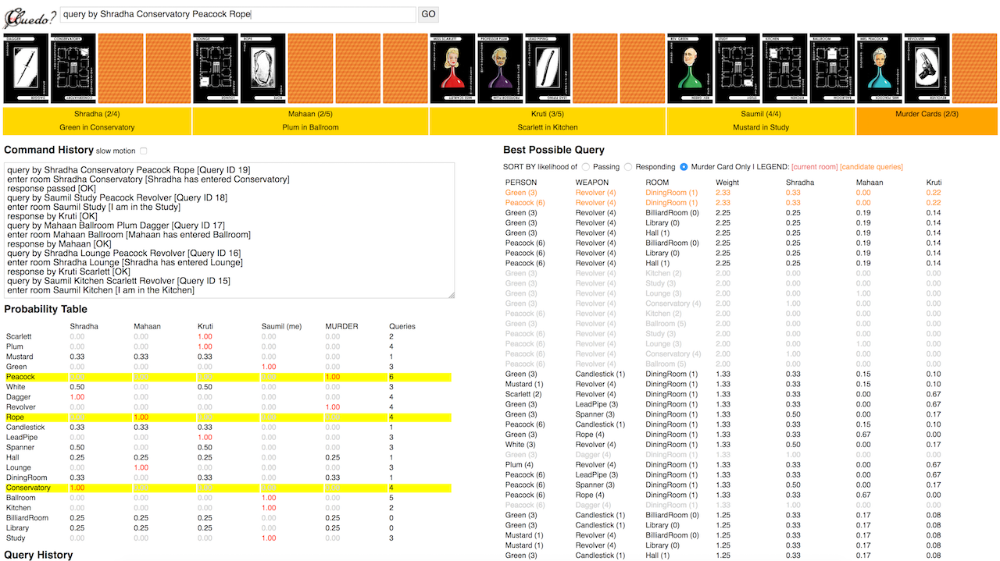

Cluedo - The Ultimate Detective Game
====================================

A bit of history
----------------

I was introduced to Cluedo during my high school years by my parents. My father had purchased the game in the mid 60s, and it had become a smash hit with our family back then. Over the years, the games were tucked away until one day we decided to dust it off. Cluedo is a very exciting and educational game. Players take turns as detectives trying to solve a murder mystery by eliminating improbable clues. Fast forward to January 2017, I had been collaborating with a board gamer friend of ours, Shradha Jain, who runs Studio Clock Works in Ahmedabad. Shradha was excited at the prospect of playing Cluedo with us. One night, we got a round of Cluedo going.

Our Cluedo board is over 50 years old! The plastic player tokens and weapon tokens survived very well. Not so much the player cards. My parents had tried to fix the old and brittle cards by gluing regular playing cards on the back of the old Cluedo cards. However, a point came where the old cards simply became worn and brittle. Corners started chipping off and cracks appearing across the cards' middle.

At one point we contemplated buying a new Cluedo game set, but we simply did NOT like the new design. The classic board and cards were simply too good to let go. We decided to restore the game, preserving the classic look and feel that we have grown to love.

Shradha undertook the task of printing new cards for us. I found some old Cluedo card images online and generated new card templates in Photoshop. After a lot of pixel pushing, I had a set of card images ready. Shradha came back after a week with a set of beautifully printed Cluedo cards! And she even printed an M C Escher pattern on the card backs!

The Game Is Afoot!

The Automatic Cluedo Machine
----------------------------

While Shradha was working on printing new Cluedo cards for us, I started thinking about the fundamental logic and strategies that Cluedo is based upon. Why can't we write a program that plays Cluedo just as a regular player? How can we make the program play intelligently and efficiently? Nowadays one might simply respond back with the buzz words of the decade - "Machine Learning" and "AI" - but that's overkill. We don't need a neural network to make a computer play Cluedo.

### The Mathematics behind Cluedo

Playing Cluedo involves two core mathematical concepts. **Probability** and **Boolean Logic**. Players have to uncover the person who committed the murder, the room in which the murder took place and the weapon used. Three cards are hidden under the board and the rest are distributed as clues to each player. During the course of the game, players show clues to one another, eliminating the cards from the set of murder suspects. When we play Cluedo, we are using probability and Boolean logic intuitively. If player X has Miss Scarlett, then she is not the murderer. If player Y showed a card to player Z, and if I have the Revolver card, then there's a 50% chance that Y showed a room card and a 50% chance that Y showed a person card to Z.

I started thinking about an approach to programmatically play Cluedo. Over a few nights, I implemented a probability table that shows the probability of each card as held by every player. As the game progresses, observed cards are eliminated from the probability table and the list of possible murder combinations shrinks. I also assigned a system of numeric weights based on the probability to determine what the computer's query should be during its turn.

Here is how the **Automatic Cluedo Machine** looks like:

Try out the [**Automatic Cluedo Machine**](https://therealsaumil.github.io/cluedo-game/cluedo.html) here.

For a quick test, cut and paste the commands from the following sample games data:

[Sample Game 1](sample_games/game3_commands.txt)

[Sample Game 2](sample_games/game4_commands.txt)

[Sample Game 3](sample_games/game6_commands.txt)

[Sample Game 4](sample_games/game7_commands.txt)
